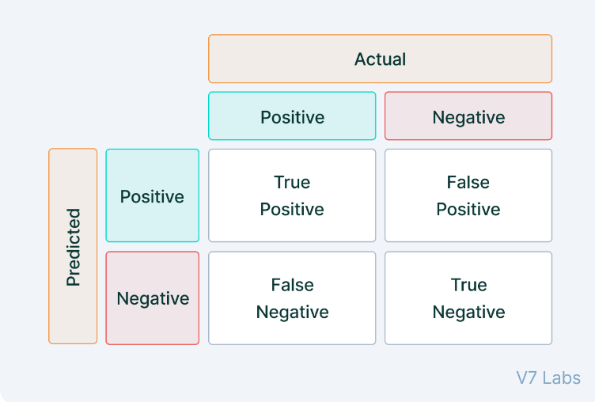
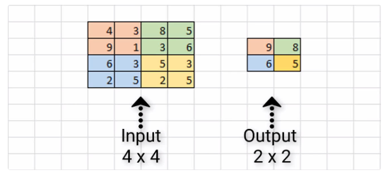
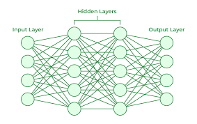
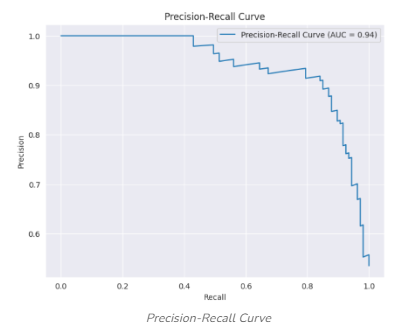
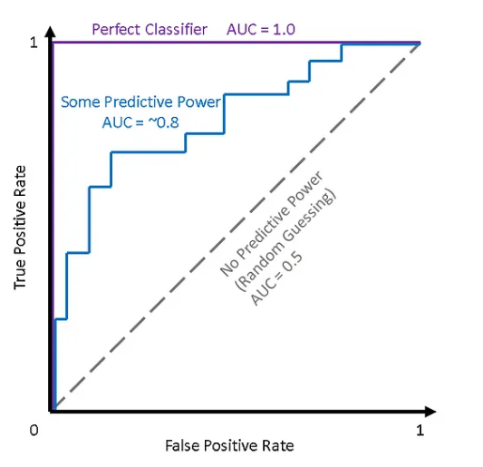
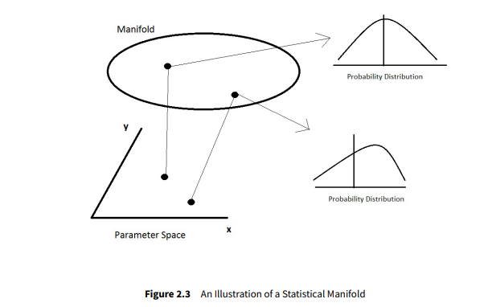

(glossary_ref)=

# Glossary

## A

### **Accuracy** 

A metric for evaluating [**Classification**](#classification) models based on the fraction of predictions our model got correct. Mathematically, accuracy has the following definition:
- $Accuracy = 
\frac{\text{Number of correct predictions}}{\text{Total number of predictions}}$

For [**Binary Classification**](#binary-classification), it is defined as the following:
- $Accuracy = 
\frac{(TP + TN)}{(TP + TN + FP + FN)}$ \
where: 

- [*TP*](#true-positive-rate-tp) = **True Positive Rate**
- [*TN*](#true-negative-rate-tn) = **True Negative Rate**
- [*FP*](#false-positive-rate-fp) = **False Positive Rate**
- [*FN*](#false-negative-rate-fn) = **False Negative Rate**

See [**Classification**](#classification), [**False Negative Rate**](#false-negative-rate-fn), [**False Positive Rate**](#false-positive-rate-fp), [**True Negative Rate**](#true-negative-rate-tn), and [**True Positive Rate**](#true-positive-rate-tp). 

A binary example with benign and malignant tumor detection rates is shown in the following image:

### **Area Under the ROC Curve (AUROC)**

The Area Under the ROC Curve (AUROC) is a metric that measures the performance of a [**Classification**](#classification) model at all possible classification thresholds. It's calculated by measuring the two-dimensional area underneath a ROC curve from (0,0) to (1,1). AUROC can range from 0 to 1, with higher values indicating better performance:

An example scale might be:

- 0: A perfectly inaccurate test
- 0.1-0.4: Unacceptable. Inaccurate a majority of the time
- 0.5: A random model or no discrimination
- 0.6: Unacceptable. Low discrimination
- 0.7–0.8: Acceptable
- 0.8–0.9: Excellent
- 1: A perfect model that can correctly distinguish between all positive and negative class points

See [**Classification**](#classification) and [**ROC**](#receiver-operating-characteristic-roc-curve) 

### **Artificial Intelligence (AI)**

Artificial Intelligence, or AI, is technology that enables computers and machines to simulate human intelligence and problem-solving capabilities. It is modeled after the decision-making processes of the human brain that can ‘learn’ from available data and make increasingly more accurate classifications or predictions over time.  For the applications in [**DataEval**](#dataeval), [**Neural Networks**](#neural-network) are the main modeling method.

See [**Neural Networks**](#neural-network).

### **Aspect Ratio**

For Images, the ratio of the width (in pixels) over the height (in pixels)
- $Aspect Ratio = \frac{width}{height}$

See [**Image Size**](#image-size)

### **Autoencoder**

An autoencoder is a type of artificial [**Neural Network**](#neural-network) that learns efficient encodings of unlabeled data by doing [**Unsupervised Learning**](#unsupervised-learning). An autoencoder learns two functions: an encoding function that transforms the input data into a [**Latent Space**](#latent-space), and a decoding function that recreates the input data from the encoded representation. Typically used for [**Dimensionality Reduction**](#dimensionality-reduction). 

See [**Dimensionality Reduction**](#dimensionality-reduction), [**Latent Space**](#latent-space), [**Neural Network**](#neural-network), and [**Unsupervised Learning**](#unsupervised-learning).

### **Average Pooling**

A type of [**Pooling Layer**](#pooling-layer) that calculates the average value from a group of pixel values produced by a [**Convolutional Layer**](#convolutional-layer). Typically used in a [**Convolutional Neural Network**](#convolutional-neural-network-cnn) to reduce the dimensionality between layers.

See [**Pooling Layer**](#pooling-layer).

## B

### **Balance**

A measure of co-occurrence of metadata factors with class labels.  Metadata factors that spuriously correlate with individual classes may allow a model to learn shortcut relationships rather than the salient properties of each class.

### **Bayes Error Rate (BER)**

In statistical classification, bayes error rate is the lowest possible error rate for any classifier of a random outcome (into, for example, one of two categories) and is analogous to the [**Irreducible Error**](#irreducible-error). A number of approaches to the estimation of the bayes error rate exist. In general, it is impossible to compute the exact value of the bayes error. 

See [**Irreducible Error**](#irreducible-error).

### **Bias**

The systematic error or deviation in a model's predictions from the actual outcomes. Bias can arise from various sources, such as a skewed or imbalanced dataset, incomplete feature representation, or the use of biased algorithms.

### **Binary Classification**

Binary classification is a fundamental task in [**Machine Learning**](#machine-learning-ml), where the goal is to categorize data into one of two classes or categories.

### **Black-box Shift Estimation (BBSE)**

A method for measuring [**Label Shift**](#label-shift) on machine learning datasets. It is calculated using a [**Confusion Matrix**](#confusion-matrix) and only requires that the matrix be invertible. It calculates the probability of a label *l* in the target dataset over the probability of the same label in the test data set. $(W = \frac{q(y)}{p(y)})$  It is solved as a linear equation $Ax = b$ where *A* is the Confusion Matrix estimated on the training dataset and *b* is average output of the predictor function calculated on the target dataset. 

See [**Confusion Matrix**](#confusion-matrix) and [**Label Shift**](#label-shift).

### **Blur**

For Images, the loss of sharpness resulting from motion of the subject or the camera during exposure. Objects appear less clear or distinct. It is calculated using the [**Variance**](#variance) on a [**Laplacian Filter**](#laplacian-filter). A low value on the variance indicates very few sharp edges which points toward a blurry image.

See [**Laplacian Filter**](#laplacian-filter) and [**Variance**](#variance).

### **Bonferroni Correction**

The Bonferroni Correction is a multiple-comparison correction used when several dependent or independent statistical tests are being performed simultaneously. The reason is that while a given alpha value may be appropriate for each individual comparison, it is not appropriate for the set of all comparisons.

### **Brightness**

For images, brightness is a measure of how light or dark an image is overall, or its luminous intensity after it's been digitized or acquired by a camera. It can also be described as the relative intensity of a visible light source's energy output.

## C

### **Categorical Variable**  

In statistics, a categorical variable (also called qualitative variable) is a variable that can take on one of a limited, and usually fixed, number of possible values, assigning each individual or other unit of observation to a particular group or nominal category on the basis of some qualitative property. 

### **Channel (Images)**

Descriptive component of an image. For example, gray-scale images have one channel describing [**Brightness**](#brightness) levels, while red-green-blue (RGB) images have 3 channels describing the red, green, blue brightness levels.

See [**Brightness**](#brightness).

### **Chi-square Test of Independence** 

The Chi-Square Test of Independence determines whether there is an association between [**Categorical Variables**](#categorical-variable) (i.e., whether the variables are independent or related).  For more information on how to compute see the following explanation: [*Chi Square Test Of Independence*](https://libguides.library.kent.edu/SPSS/ChiSquare)

See [**Categorical Variable**](#categorical-variable). 

### **Classification**

Classification is a supervised machine learning method where the model tries to predict the correct label of a given input data value. For instance, an algorithm can learn to predict whether a given email is spam or ham (no spam) or whether an image contains a house or a car.

### **Cluster Analysis**

Cluster Analysis is a statistical method for processing data. It is primarily used in [**Classification**](#classification) projects. It works by organizing items into groups, or clusters, based upon how closely associated they are. The objective of cluster analysis is to find similar groups of subjects, where the “similarity” between each pair of subjects represents a unique characteristic of the group vs. the larger population/sample. It is an [**Unsupervised Learning**](#unsupervised-learning) algorithm, meaning the number of clusters is unknown before running the model.

See [**Classification**](#classification) and [**Unsupervised Learning**](#unsupervised-learning).

### **Concept Drift**

Concept drift is a specific kind of data [**Drift**](#drift) where there is a change in the relationship between the input data and the model target. It reflects the evolution of the underlying problem statement or process over time. 

See [**Drift**](#drift).

### **Confidence Level**

In statistics, the confidence level indicates the probability with which the estimation of the location of a statistical parameter (e.g., an arithmetic mean) in a sample survey is also true for the actual population.

### **Confusion Matrix**

A matrix made up of the following measurements: [**True Positives**](#true-positive-rate-tp), [**True Negatives**](#true-negative-rate-tn), [**False Positives**](#false-positive-rate-fp) and [**False Negatives**](#false-negative-rate-fn).  An image is shown below.

See [**False Negatives**](#false-negative-rate-fn), [**False Positives**](#false-positive-rate-fp), [**True Negatives**](#true-negative-rate-tn), and [**True Positives**](#true-positive-rate-tp).

### **Contractive Autoencoder (CAE)**

A type of [**Autoencoder**](#autoencoder) which is designed to be sensitive to small changes in the training dataset. It attempts to increase the robustness of the model by emphasizing the accurate encoding of small changes in the training data. 

### **Coverage**

A measure of the distribution of the images in a dataset. A covered dataset has at least one image for every distinguishing property of the data set.

### **Convolutional Layer**

Input layer to a [**Convolutional Neural Network (CNN)**](#convolutional-neural-network-cnn). Core building block of CNN where a majority of the computation occurs.  It requires 3 components; input data, a filter or kernel (matrix), and a feature map. The kernel sweeps across the input data's feature map using a dot product operation to 'find' the features. This process is called convolution. 

See [**Convolutional Neural Network (CNN)**](#convolutional-neural-network-cnn).

### **Convolutional Neural Network (CNN)**

A type of [**Deep Neural Network (DNN)**](#deep-neural-networks-dnn) used in computer vision applications such as image classification, image segmentation and image and video recognition. It uses at a minimum of 3 layers; the convolutional layer, the pooling layer and the [**Fully Connected (FC) Layer**](#fully-connected-layer). With each layer, the CNN increases its complexity, identifying greater portions of the input image.

See [**Deep Neural Network (DNN)**](#deep-neural-networks-dnn) and [**Fully Connected (FC) Layer**](#fully-connected-layer).

### **Cramér-von Mises (CVM) Drift Detection**

The Cramér-von Mises algorithm tests the [**Null Hypothesis**](#null-hypothesis) that a data sample (i.e. operational dataset), comes from a pre-specified population distribution or a family of such distributions with the idea that if the operational dataset does not come from the same distribution or family of distributions as the training dataset then data drift may have occurred. It is similar to the [**Kolmogorov-Smirnov**](#kolmogorov-smirnov-k-s-test) test.

See [**Kolmogorov-Smirnov Test**](#kolmogorov-smirnov-k-s-test) and [**Null Hypothesis**](#null-hypothesis).

## D

### **DataEval**

Name of the ARiA application for Test and Evaluation (T&E) of [**Machine Learning (ML)**](#machine-learning-ml) and [**Artificial Intelligence (AI)**](#artificial-intelligence-ai) applications.

See [**Artificial Intelligence (AI)**](#artificial-intelligence-ai) and [**Machine Learning (ML)**](#machine-learning-ml).

### **Dataset Splits**

Dataset splits, also known as data splitting, is the process of dividing a data set into multiple subsets to help train, test and evaluate machine learning models. 

### **Deduplication**

The process of identifying and exact or extremely similar data or images from a data set. A near duplicate is defined as within one standard deviation of the relevant distance statistic within a cluster of a data point in a data set. 

### **Deep Neural Networks (DNN)**

A deep neural network is an artificial [**Neural Network**](#neural-network) with multiple layers between the input and output layers. There are different types of neural networks but they generally consist of the same components: weights, biases, and activation function (and corresponding locations in the network). These components, as a whole, mimic the functionality of the human brain.

See [**Neural Network**](#neural-network).

### **Denoising Autoencoder (DAE)**

A type of [**Autoencoder**](#autoencoder) which is designed to increase its robustness by stochastically training the model for the reconstruction phase rather than the encoding phase. 

### **Developmental Dataset**

Dataset used in for machine learning model development. It consists of several [**Dataset Splits**](#dataset-splits) that can include training, validation and testing splits. 

See [**Dataset Splits**](#dataset-splits).

### **Dimensionality Reduction**

Dimensionality reduction is a method for representing a given dataset using a lower number of features (i.e. dimensions) while still capturing the original data’s meaningful properties. This amounts to removing irrelevant or redundant features, or simply noisy data, or combining features into a reduced number of new features to create a model with a lower number of variables.

### **Divergence**

Divergence is a kind of statistical distance: a function which establishes the separation from one probability distribution to another on a statistical [**Manifold**](#manifold).

See [**Manifold**](#manifold). 

### **Diversity**

A measure of the distribution of metadata factors in the dataset. A balanced dataset has an even distribution of class labels and generative factors.

### **Drift**

In predictive analytics, data science, [**Machine Learning**](#machine-learning-ml) and related fields, the phenomenon where the statistical properties of the data change over time. It occurs when the underlying distribution of the input features or the target variable (what the model is trying to predict) shifts, leading to a discrepancy between the training data and the real-world data the model encounters during deployment.

### **Duplicates**

Statistical duplicates, or duplicate data, are repeated records or observations in a dataset. They can be caused by human error, technical errors, and/or data manipulation. In the case of [**DataEval**](#dataeval) for the image classification and/or detection tasks, exact matches are found using a byte hash of the image information, while near matches use a [**Perception-Based Hash**](#perception-based-hash).

See [**Perception-Based Hash**](#perception-based-hash).

## E

### **Embeddings**

Embeddings are representations of values or objects like text, images, and audio that are designed to be consumed by machine learning models and semantic search algorithms.

### **Epoch**

Each time a dataset passes through an algorithm, it is said to have completed an epoch. Therefore, epoch, in [**Machine Learning**](#machine-learning-ml), refers to one entire pass of training data through the algorithm.

## F

### **F1-score**

One way to capture the precision-recall curve in a single metric.  F1-score combines [**Precision**](#precision) and [**Recall**](#recall) scores with equal weight, and works also for cases where the datasets are imbalanced as it requires both precision and recall to have a reasonable value. It is the harmonic mean of precision and recall and has a range of [0-1]. It is defined as follows:
- $F1 = 2* \frac{\text{( Precision * Recall)}}{\text{(Precision + Recall)}}$

See [**Precision**](#precision) and [**Recall**](#recall).

### **False Discovery Rate (FDR)**

The FDR is defined as the ratio of the number of [**False Positive (FP)**](#false-positive-rate-fp) classifications (false discoveries) to the total number of [**True Positive (TP)**](#true-positive-rate-tp) classifications (rejections of the null). 

- $FDR = \frac{FP}{(FP + TP)}$ \
where:

- [*TP*](#true-positive-rate-tp) = True Positive Rate
- [*FP*](#false-positive-rate-fp) = False Positive Rate

### **False Discovery Rate (FDR) Correction**

False Discovery Rate Correction is a statistical procedure for correcting for the problem caused by running multiple hypothesis tests at once.  It is typically used in high-throughput experiments in order to correct for random events that falsely appear significant.

### **False Negative Rate (FN)**

A measure of machine learning model accuracy. It measures the frequency at which a negative prediction was found for a positive ground truth value.

See [**Confusion Matrix**](#confusion-matrix)

### **False Positive Rate (FP)**

A measure of machine learning model accuracy. It measures the frequency at which a positive prediction was found for a negative ground truth value.

See [**Confusion Matrix**](#confusion-matrix)

### **FB Score**

F "Beta" Score: The F-beta score is the weighted harmonic mean of [**Precision**](#precision) and [**Recall**](#recall) with a range of 0 (worst) to 1 (best). The beta ($\beta$) parameter represents the ratio of the recall importance to precision importance. A value greater than 1 gives more weight to recall while a value less than 1 favors precision.  The formula is shown below:
- $F_\beta =\frac{(1 +\beta^2)TP}{(1 +\beta^2)TP + FP + \beta^2FN}$ \
where:

- [*TP*](#true-positive-rate-tp) = **True Positive Rate**
- [*FP*](#false-positive-rate-fp) = **False Positive Rate**
- [*FN*](#false-negative-rate-fn) = **False Negative Rate**

See [**False Negative Rate**](#false-negative-rate-fn), [**False Positive Rate**](#false-positive-rate-fp), [**Precision**](#precision) and [**Recall**](#recall), and [**True Positive Rate**](#true-positive-rate-tp). 

### **Feasibility**

Feasibility is a measure of whether the available data (both quantity and quality) can be used to satisfy the necessary performance characteristics of the machine learning model.

### **Fully-Connected Layer**

Layer in a [**Neural Network**](#neural-network).  Every node in the layer is connected to every node in the previous layer. It performs the task of classification by creating probabilities that input data contains the features filtered for by the neural network. 

## G

### **Generative Model**

A type of machine learning model which can generate new data that is similar to the input/training data for the model. For example, large language models (LLMs) are able to generate new text from their large pool of language data. 

## H

### **Hamming Distance (Images)**

The Hamming Distance between two strings of equal length is the number of positions at which these strings vary. In more technical terms, it is a measure of the minimum number of changes required to turn one string into the other. In [**DataEval**](#dataeval), images are turned (hashed) into strings in order to compute their Hamming Distance.

### **Hilbert Space**

A  Hilbert Space is an inner product space that is a complete space where distance between instances can be measured with respect to the norm or distance function induced by the inner product. The Hilbert Space generalizes the Euclidean space to a finite or infinite dimensional space. Usually, the Hilbert Space is high dimensional. By convention in [**Machine Learning**](#machine-learning-ml), unless otherwise stated, Hilbert space is also referred to as the *feature space*.

## I

### **Image Size**

The total number of pixels in an image. It is the product of the width (in pixels) and height (in pixels).
- $Image Size = width*height$

### **Inference**

Statistical inference is a method of making decisions about the parameters of a population, based on random sampling. 

### **Irreducible Error**

The irreducible error, also known as noise, represents the variability or randomness in the data that cannot be explained by a regression model. The irreducible error arises from various sources such as unmeasured variables, measurement errors, or natural variability in the target variable. It is independent of the predictor variables X and cannot be reduced by improving the model. The only way to reduce irreducible error is by improving the quality of the data or acquiring additional information that captures the unexplained variability.

See [**Bayes Error Rate**](#bayes-error-rate-ber)

## J

### **Joint Sample**

A joint sample is a draw from the underlying distribution of both input data and its (potentially unknown) corresponding label. The correlation between input data and matching label is what a model attempts to capture. The joint distribution from which the joint sample is drawn characterizes this correlation.

## K

### **Kolmogorov-Smirnov (K-S) Test**

In statistics, the Kolmogorov–Smirnov Test is a nonparametric test of the equality of continuous, one-dimensional probability distributions that can be used to test whether a sample came from a given reference probability distribution (one-sample K–S test), or to test whether two samples came from the same distribution (two-sample K–S test). Intuitively, the test provides a method to qualitatively answer the question "How likely is it that we would see a collection of samples like this if they were drawn from that probability distribution?" or, in the second case, "How likely is it that we would see two sets of samples like this if they were drawn from the same (but unknown) probability distribution?". It is named after Andrey Kolmogorov and Nikolai Smirnov.

## L

### **Label Shift**

In many real-world applications, the target (testing) distribution of a model can differ from the source (training) distribution. Label shift arises when class proportions differ between the source and target, but the feature distributions of each class do not. For example, the problems of bird identification in San Francisco (SF) versus New York (NY) exhibit label shift. While the likelihood of observing a snowy owl may differ, snowy owls should look similar in New York and San Francisco.

### **Laplacian Filter**

The Laplacian filter is an edge detection filter. It uses the second derivatives of an image to find regions of rapid intensity change. 

### **Latent Space**

Also known as a Latent Feature Space or Encoded Space, is an embedding of a set of items within a [**Manifold**](#manifold) in which items resembling each other under some encoding are positioned close to one another.  Positions are defined by a set of *latent* variables that emerge from the properties of the objects. For example, placing images within a Guassian Distribution based upon their color properties defines the parameters of the Guassian and reduces the number of parameters for the images.  

See [**Manifold**](#manifold).

### **Linter**

The data linter identifies potential issues (lints) in the ML training data. The term "linter" stems from the origins of a tool known as "lint," which was initially developed by Stephen C. Johnson in 1978 at Bell Labs. For [**DataEval**](#dataeval) and imagery, it identifies issues such as image quality (overly bright/dark, overly blurry, lacking information) or unusual image properties (shape,size, **channels*). 

See [**DataEval**](#dataeval).

## M

### **Machine Learning (ML)**

Machine learning (ML) is a branch of [**Artificial Intelligence (AI)**](#artificial-intelligence-ai) and computer science that focuses on the using data and algorithms to enable AI to imitate the way that humans learn, gradually improving its accuracy. In general, machine learning algorithms are used to make a prediction or [**Classification**](#classification). Based on some input data, which can be labeled or unlabeled, your algorithm will produce an estimate about a pattern in the data. 

See [**Artificial Intelligence (AI)**](#artificial-intelligence-ai) and [**Classification**](#classification).

### **Manifold**

In mathematics, a manifold is a topological space that locally resembles Euclidean space near each point. One dimensional manifolds include lines and circles. Two dimensional manifolds are also called surfaces. One example is the family of Guassian or Normal Functions. They form a manifold parameterized by the expected value and [**Variance**](#variance) of the Guassian functions. 

### **Maximum Pooling**

Method used in the [**Pooling Layer**](#pooling-layer) of a [**Convolutional Neural Network**](#convolutional-neural-network-cnn). It uses the maximum value in a group of pixel values (typically a 2 x 2 or 3 x 3 area) produced from the [**Convolutional Layer**](#convolutional-layer) to reduce the dimensionality of the result. An image of the operation is shown below.

See [**Pooling Layer**](#pooling-layer).

### **Maximum Mean Discrepancy (MMD) Drift Detection**

MMD Drift Detection is a method which compares the mean [**Embeddings**](#embeddings) of each sample: A reference sample and a target sample. For example, one might use the mean image embedding for a set of training data, and compare that to the mean embedding of an operational dataset. If the two means are significantly different from one another, drift is detected. What constitutes a "significant" difference stems from underlying assumptions about the distribution of embeddings. More info can be found here: 
[MMD Reference Paper](https://www.stat.berkeley.edu/~ryantibs/papers/radonks.pdf).

See [**Drift](#drift) and [**Embeddings**](#embeddings).

### **Mean Average Precision**

A measure to evaluate the performance of object detection and segmentation systems over all classes covered by the system. It is calculated using the [**Confusion Matrix**](#confusion-matrix), [**Precision**](#precision) and [**Recall**](#recall) metrics and the [**Area Under the Curve (AUC)**](#area-under-the-roc-curve-auroc) metric.  It is the average precision for each class averaged over the number of classes. 

See [**Area Under the Curve (AUC)**](#area-under-the-roc-curve-auroc), [**Confusion Matrix**](#confusion-matrix), [**Precision**](#precision) and [**Recall**](#recall).

### **Minimum Pooling**

Method used in the [**Pooling Layer**](#pooling-layer) of a [**Convolutional Neural Network**](#convolutional-neural-network-cnn). It uses the minimum value in a group of pixel values (typically a 2 x 2 or 3 x 3 area) produced from the [**Convolutional Layer**](#convolutional-layer) to reduce the dimensionality of the result.

See [**Pooling Layer**](#pooling-layer).

### **Modular AI Trustworthy Engineering (MAITE)**

A toolbox of common types, protocols (a.k.a. structural subtypes) and tooling to support AI test and evaluation (T & E) workflows.  Part of the Joint AI T&E Infrastructure Capability (JATIC) program. Its goal is to streamline the development of JATIC Python projects by ensuring seamless, synergistic workflows when working with MAITE-conforming Python packages for different T&E tasks. 

### **Mutual Information (MI)**

In probability theory and information theory, the mutual information of two random variables is a measure of the mutual dependence between the two variables. More specifically, it quantifies the "amount of information" obtained about one random variable by observing the other random variable.

## N

### **Neural Network**

A neural network is a method in [**Artificial Intelligence (AI)**](#artificial-intelligence-ai) that teaches computers to process data in a way that is inspired by the human brain. An example depiction is shown below:

See [**Artificial Intelligence (AI)**](#artificial-intelligence-ai).

### **Null Hypothesis**

In scientific research, the null hypothesis (often denoted H0) is the claim that the effect being studied does not exist. The null hypothesis can also be described as the hypothesis in which no relationship exists between the two sets of data or variables being analyzed. If the null hypothesis is true, any experimentally observed effect is due to chance alone, hence the term "null".

### **NumPy**

NumPy is a Python Library used for working with arrays. It also has functions for working in linear algebra, fourier transforms and matrices (used in convolution). NumPy was created in 2005 by Travis Oliphant. 

## O

### **Object Detection**

Object Detection is a computer vision technique for locating instances of objects in images or videos. Object detection algorithms typically leverage [**Machine Learning**](#machine-learning-ml) or *deep learning* to produce meaningful results.

See [**Machine Learning**](#machine-learning-ml).

### **Outliers (Images)**

Images which differ significantly from all or most of the other images in a dataset.

### **Outlier Detection**

Outlier Detection is process of detecting data/images that significantly deviate from the rest of the data/images.  [**DataEval**](#dataeval) uses the measure of two standard deviations of the  average of the relevant distance measure to identify outliers.

### **Out-of-distribution (OOD)**

Out-of-distribution (OOD) data refers to data that is different from the data used to train the machine learning model. For example, data collected in a different way, at a different time, under different conditions, or for a different task than the data on which the model was originally trained. An illustration is shown below:

### **Operational Dataset**

Dataset used while a machine learning model is in operation and not used or seen during training.  It may or may not match the characteristics of the [**Developmental Dataset**](#developmental-dataset) (see [**Drift**](#drift)).

See [**Drift**](#drift).

### **Operational Drift**

Operational drift is specific type of [**Drift**](#drift) defined as data drift during data model operations.  It occurs when the data used in operation is not like data used during training of a machine learning model. It can make the model less accurate in its predictions/classifications.

See [**Drift**](#drift).

### **Overfitting**

Overfitting occurs when the machine learning model cannot generalize. The model begins to predict heavily towards the distribution of the [**Developmental Dataset**](#developmental-dataset) which can hurt the model's predictions on the [**Operational Dataset**](#operational-dataset). Overfitting happens due to several reasons, such as: 
- The training data size is too small and does not contain enough data samples to accurately represent all possible input data values.
- The training data contains large amounts of irrelevant information, called noisy data.
- The model trains for too long on a single sample set of data.
- The model complexity is high, so it learns the noise within the training data.

See [**Developmental Dataset**](#developmental-dataset) and [**Operational Dataset**](#operational-dataset).

## P

### **P-Value**

A p-value, or probability value, is a number describing how likely it is that your data would have occurred under the [**Null Hypothesis**](#null-hypothesis) of your statistical test.

See [**Null Hypothesis**](#null-hypothesis).

### **Parity**

Parity, in data analysis, measures the [**Statistical Independence**](#statistical-independence) between class labels and metadata factors using a [**Chi-Square Test**](#chi-square-test-of-independence). A lack of independence indicates bias. See [**Bias**](#bias).

See [**Chi-Square Test**](#chi-square-test-of-independence) and [**Statistical Independence**](#statistical-independence).

### **Perception-based Hash**

Hashing algorithms designed to remain unchanged on very similar inputs. They are designed to detect similar characteristics such as images that have only changed in color, brightness or compression method. So-called *pHashes*, allow for the comparison of two images by looking at the number of different bits between the input and a second image. This difference is known as the **Hamming Distance**.

See [**Hamming Distance**](#hamming-distance-images).

### **Pooling Layer**

Layers within a [**Convolutional Neural Network (CNN)**](#convolutional-neural-network-cnn), also known as *downsampling layers*.  Similar to the [**Convolutional Layer**](#convolutional-layer), they typically sweep across the output of a convolutional layer and apply aggregation functions using a similar kernel calculation to the output.  A lot of information is lost in the pooling layer but they reduce complexity, improve efficiency and limit the risk of [**Overfitting**](#overfitting) to the [**Developmental Dataset**](#developmental-dataset). The functions include [**Minimum Pooling**](#minimum-pooling), [**Maximum Pooling**](#maximum-pooling) and [**Average Pooling**](#average-pooling).

See [**Average Pooling**](#average-pooling), [**Convolutional Layer**](#convolutional-layer), [**Convolutional Neural Network (CNN)**](#convolutional-neural-network-cnn), [**Developmental Dataset**](#developmental-dataset), [**Maximum Pooling**](#maximum-pooling), [**Minimum Pooling**](#minimum-pooling) and [**Overfitting**](#overfitting). 

### **Precision**

A measure of how often a machine learning model correctly predicts the positive class. It is defined as the [**True Positive (TP)**](#true-positive-rate-tp) rate divided by the sum of the True Positive (TP) and [**False Positive (FP)**](#false-positive-rate-fp) rates. 

- $Precision = \frac{TP}{( TP + FP )}$ \
where: 

- [*TP*](#true-positive-rate-tp) = True Positive Rate
- [*FP*](#false-positive-rate-fp) = False Positive Rate

See [**False Positive (FP)**](#false-positive-rate-fp) and [**True Positive (TP)**](#true-positive-rate-tp).

### **Precision Recall Curve**

A plot which shows [**Precision**](#precision) (Y Axis) vs. [**Recall**](#recall) (X axis) scores for one or more machine learning models as a function of the [**Confidence Level**](#confidence-level) to make a prediction.  In general, as confidence levels drop, precision decreases as recall increases.  The curves are used to visualize the accuracy of a model using various measures including [**'F1' Score**](#f1-score), [**Area Under the Curve (AUROC)**](#area-under-the-roc-curve-auroc) and *Average Precision (AP)*. An example is shown below:

See [**Area Under the Curve (AUROC)**](#area-under-the-roc-curve-auroc), [**Confidence Level**](#confidence-level), and [**'F1' Score**](#f1-score).

### **Principal Component Analysis (PCA)**

Principal component analysis (PCA) is a linear [**Dimensionality Reduction**](#dimensionality-reduction) technique with applications in exploratory data analysis, visualization and data preprocessing. The data is linearly transformed onto a new coordinate system such that the directions (principal components) capturing the largest variation in the data can be easily identified.

See [**Dimensionality Reduction**](#dimensionality-reduction).

### **Probability Distribution**

A Probability Distribution is a mathematical function that gives the probabilities of occurrence of different possible random outcomes for an experiment. It can be defined for both discrete and continuous variables. 

## Q

## R

### **Recall**

A measure of the [**Accuracy**](#accuracy) of a machine learning model.  It is the ability of a model to find all of the relevant cases within a data set. It is defined as the [**True Positive (TP) Rate**](#true-positive-rate-tp) over the sum of the *True Positive Rate* and [**False Negative (FN) Rate**](#false-negative-rate-fn).
- $Recall = \frac{TP}{( TP + FN)}$ \
where:

- [*TP*](#true-positive-rate-tp) = True Positive Rate
- [*FN*](#false-negative-rate-fn) = False Negative Rate

See [**Accuracy**](#accuracy), [**False Negative (FN)**](#false-negative-rate-fn), and [**True Positive (TP)**](#true-positive-rate-tp).

### **Regularized Autoencoder**

A type of [**Autoencoder** ](#autoencoder) used mostly in [**Classification**](#classification) tasks. Types include *Sparse*, *Denoising* and *Contractive*. Regularization is a method for constraining the model in order to prevent [**Overfitting**](#overfitting) and improve its ability to generalize to new data.

See [**Autoencoder**](#autoencoder) and [**Overfitting**](#overfitting).

### **Riemannian Manifold**

A manifold where distances and angles can be measured.  Type of manifold where [**Divergence**](#divergence) can be measured.

See [**Divergence**](#divergence).

### **Receiver Operating Characteristic (ROC) Curve**

A curve frequently used to evaluate the performance of [**Binary Classification**](#binary-classification) algorithms. It provides a graphical representation of a classifier's performance. It plots the [**True Positive (TP) Rate**](#true-positive-rate-tp) vs the [**False Positive (FP) Rate**](#false-positive-rate-fp) at a variety of thresholds. An example image is shown below:

See [**Binary Classification**](#binary-classification), [**False Positive (FP)**](#false-positive-rate-fp) and [**True Positive (TP)**](#true-positive-rate-tp).

## S

### **Sparse Autoencoder (SAE)**

A type of [**Autoencoder**](#autoencoder) inspired by the sparse coding hypothesis in neuroscience with the idea that more relevant information will be encoded in a machine learning network if fewer nodes are activated during any single input. By penalizing activation of multiple nodes, it is hoped that more relevant information is encoded rather than passing redundant information.  

See [**Autoencoder**](#autoencoder)

### **Statistics**

Statistics is a branch of applied mathematics that involves the collection, description, analysis, and inference of conclusions from quantitative data. 

### **Statistical Independence** 

Two events are statistically independent of one another if the probability of one or either event occurring is not affected by the occurrence or nonoccurrence of the other event.

### **Statistical Manifold**

An abstract space where each point is a probability distribution. An illustration of the concept is shown below:

### **Sufficiency**

Sufficiency, in the context of data analysis and the [**DataEval**](#dataeval) tool, is the notion that the model and/or dataset are capable of satisfying the operational requirements. See [**BER**](#bayes-error-rate-ber) and [**UAP**](#upper-bound-average-precision-uap).

See [**Bayes Error Rate (BER)**](#bayes-error-rate-ber) and [**Upper-bound Average Precision (UAP)**](#upper-bound-average-precision-uap).

### **Supervised Learning**

Supervised Learning is a category of [**Machine Learning**](#machine-learning-ml) that uses labeled datasets to train algorithms to predict outcomes and recognize patterns. Unlike [**Unsupervised Learning**](#unsupervised-learning), supervised learning algorithms are given labeled training data to learn the relationship between the inputs and the outputs.

See [**Machine Learning**](#machine-learning-ml) and [**Unsupervised Learning**](#unsupervised-learning).

## T

### **TensorFlow**

TensorFlow is a free and open-source software library for [**Machine Learning**](#machine-learning-ml) and [**Artificial Intelligence**](#artificial-intelligence-ai). It can be used across a range of tasks but focuses on training and inference of [**Deep Neural Networks (DNNs)**](#deep-neural-networks-dnn). 

See [**Artificial Intelligence**](#artificial-intelligence-ai), [**Deep Neural Networks (DNNs)**](#deep-neural-networks-dnn), and [**Machine Learning**](#machine-learning-ml).

### **Torch (PyTorch)**

Torch (or Pytorch) is an open-source machine learning library.  One of its core packages provides a flexible N-dimensional array (also called a Tensor) data structure used by many machine learning algorithms. It supports routines for manipulation and calculation using Tensors.  PyTorch is a library written for the Python programming language. 

### **True Negative Rate (TN)**

A measure of machine learning model accuracy. It measures the frequency a negative prediction was found for a negative ground truth value.

See [**Confusion Matrix**](#confusion-matrix)

### **True Positive Rate (TP)**

A measure of machine learning model accuracy. It measures the frequency a positive prediction was found for a positive ground truth value.

See [**Confusion Matrix**](#confusion-matrix)

## U

### **Unsupervised Learning**

Unsupervised learning is a branch of [**Machine Learning**](#machine-learning-ml) that learns from data without human supervision. Unlike [**Supervised Learning**](#supervised-learning), unsupervised machine learning models are given unlabeled data and allowed to discover patterns and insights without any explicit guidance or instruction.

See [**Machine Learning**](#machine-learning-ml) and [**Supervised Learning**](#supervised-learning).

### **Upper-bound Average Precision (UAP)**

Object detection equivalent of [**Bayes Error Rate (BER)**](#bayes-error-rate-ber). An estimate of an upper bound on performance for an object detection model on a dateset.

See [**Bayes Error Rate (BER)**](#bayes-error-rate-ber).

## V

### **Variance**

In probability theory and statistics, variance is the expected value of the squared deviation from the mean of a random variable. Variance is a measure of dispersion from the average value. 

### **Variational Autoencoder: (VAE)**

A type of [**Autoencoder**](#autoencoder) used extensively in generative models (e.g. Large Language Models (LLMs)) because of its ability to generate new content. The encoder maps each data point (such as an image) from a large complex dataset into a distribution (e.g. Guassian) within a [**Latent**](#latent-space) or encoded space, rather than a single point. 

See [**Autoencoder**](#autoencoder) and [**Latent Space**](#latent-space).

## W

## X

## Y

## Z
